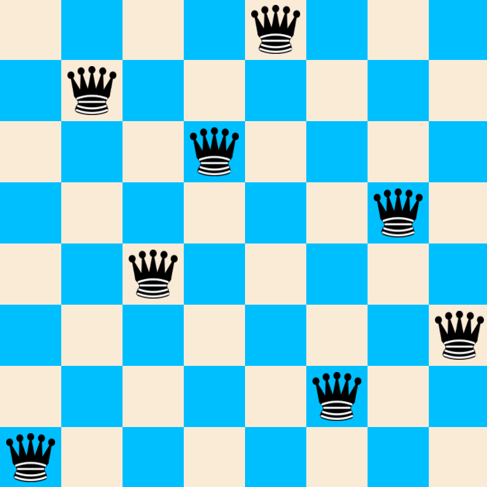

# Chess Independence Problems


The very first problem is the well-known 8-queen problem, which states as follows: place 8 queens onto a chess board so that no queens attack each other. As you know form the rules of [chess](https://en.wikipedia.org/wiki/Chess), queens can attack vertically, orizontally and diagonally.

One possible solution is this permutation:





We can represent each solution with a distinct permutation of a set containing positive integers from 1 to 8. The above picture would transpose to the folloowing permutation: ***[5, 2, 4, 7, 3, 8, 6, 1]*** There are ***92*** total solutions to this problem and ***8! = 1 * 2 * 3 * ... * 8 = 40320*** total [permutations](https://en.wikipedia.org/wiki/Permutation). In this repo a backtracking solution is implemented that generates every permnutations but selects only the correct ones. This is not the most efficient solution to this problem hence its complexity ```O(n!)```

